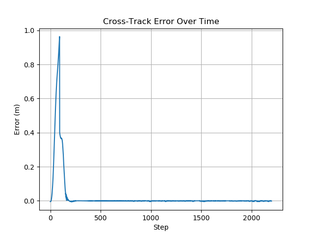

# 🚗 Ground Vehicles Navigation - System Identification & MPC

This repository implements **system identification** and **Model Predictive Control (MPC)** for a car-like robot using the [POLARIS_GEM_e2 simulator](https://gitlab.engr.illinois.edu/gemillins/POLARIS_GEM_e2).

---

## 📁 Project Structure

```
├── gem_data_log.csv                     # Logged data for system ID
├── wps.csv                              # Path waypoints
├── cross_track_error.csv               # Logged CTE over time
├── residual_model_output/
│   ├── cross_track_error.png           # Plot of CTE
│   ├── residual_training_loss.png      # Training/validation loss plot
│   ├── input_output_comparison.png     # Model vs ground-truth comparison
│   ├── residual_model_traced.pt        # Trained TorchScript model
├── logger_node.py                      # ROS node to log data
├── residual_model_trainer.py           # Trains PyTorch residual model
├── mpc_controller_node.py              # MPC controller node
├── spawn_path_markers.py               # Publishes path markers to RViz
```

---

## 🔧 Setup Instructions

### 1. Clone and Build the POLARIS_GEM_e2 Simulator

```bash
mkdir -p ~/gem_ws/src
cd ~/gem_ws/src
git clone https://gitlab.engr.illinois.edu/gemillins/POLARIS_GEM_e2.git
git clone https://github.com/Tejendra00/AGV_SysID_MPC.git
source /opt/ros/noetic/setup.bash
cd ~/gem_ws
catkin_make
```

### 2. Launch the Simulator

```bash
source devel/setup.bash
roslaunch gem_gazebo gem_gazebo_rviz.launch
rosrun gem_mpc_system_id spawn_path_markers.py 
rosrun gem_mpc_system_id mpc_controller_node.py 

```

---

## 🧠 Step 1: System Identification

- Data was logged using `logger_node.py` with a limited dataset by running the car in Pure Pursuit but with varible speed .
- I trained a residual model using `residual_model_trainer.py` to correct the kinematic model outputs (`dx`, `dy`, `dyaw`).
- Despite the small dataset, the model captured the residuals with good accuracy.

### 📉 RMSE


### 📈 Input vs Output (Residuals)


---

## 🎯 Step 2: Model Predictive Control

- Implemented in `mpc_controller_node.py` using CasADi.
- Uses the learned model for state prediction.
- Respects speed limits: Max 20 km/h (~5.56 m/s).
- Path tracking is done using waypoints from `wps.csv`.

---

## 🛣 Step 3: Path Input via CSV

- The `wps.csv` file contains the trajectory.
- To visualize it in Gazebo and RViz, use `spawn_path_markers.py` which spawns visual markers at each waypoint.

```bash
rosrun gem_mpc_system_id spawn_path_markers.py
```

This ensures that you can see the planned trajectory in simulation and verify tracking visually.

---

## 📊 Results & Analysis

### ✅ Cross-Track Error Plot



- Initial oscillations are observed due to limited training data and model uncertainty.
- However, the controller quickly stabilizes and maintains cross-track error close to **zero** for the rest of the trajectory.
- Overall, the system satisfies the tracking constraint of staying within ±1 meter CTE.
- If ran for longer time there is oscillation because the data set was collected only for one lap . If we have more data then more better model and better output can be achieved. 

---

## 🔍 System Identification Process

1. **Data Collection**: 
   - Run simulation with pure pursuit and log data via `logger_node.py`.

2. **Kinematic Prediction**:
   - Compute basic bicycle model prediction using known vehicle dynamics.

3. **Residual Learning**:
   - The difference (residual) between actual and kinematic-predicted next state is the learning target.
   - Neural network maps current state + control → residuals.

4. **Training**:
   - Split data into training and validation sets.
   - Minimize MSE loss.
   - Save best model for MPC integration.

---

## 🧠 MPC Implementation Details

1. **Controller Logic**: Defined in `mpc_controller_node.py` using CasADi.
2. **Prediction Model**: Uses kinematic model + residual correction from trained neural network.
3. **Cost Function**:
   - Penalizes deviation from desired position and heading.
   - Penalizes large steering commands.
4. **Constraints**:
   - Max speed: 5.56 m/s (20 km/h)
   - Steering angle bounds.
5. **Solver**:
   - Solves nonlinear optimization problem at each control step.
6. **Path Execution**:
   - Reads from `wps.csv`.
   - Publishes AckermannDrive commands to follow the predicted optimal trajectory.

---


## 🗂 File Descriptions

### 📄 `gem_data_log.csv`
- Logged using `logger_node.py` during simulation.
- Records:
  - Vehicle state: `odom_x`, `odom_y`, `odom_yaw`
  - Control inputs: `speed`, `steering_angle`
  - Timestamp and time delta
- Used as the dataset for system identification.

---

### 📄 `logger_node.py`
- A ROS node that subscribes to `/odom` and `/ackermann_cmd`.
- Logs timestamped vehicle state and control inputs.
- Saves data to `gem_data_log.csv` for training the residual model.

---

### 📄 `residual_model_trainer.py`
- Loads `gem_data_log.csv` and prepares data samples:
  - Input: current state and control
  - Output: residual between predicted and next state
- Uses a PyTorch neural network to learn the residual model.
- Trains a model to predict:
  - `dx = x_next - x_model`
  - `dy = y_next - y_model`
  - `dyaw = yaw_next - yaw_model`
- Saves trained model as TorchScript (`residual_model_traced.pt`)
- Plots training vs validation loss.

---

### 📄 `residual_model_output/residual_model_traced.pt`
- TorchScript-traced model for real-time deployment.
- Used by `mpc_controller_node.py` for predictions.


### 📄 `spawn_path_markers.py`
- Reads waypoints from `wps.csv` and publishes them as markers in RViz.
- Allows visualization of the path the vehicle should follow.

---

## 🙌 Acknowledgments

Thanks to Ahmad Amine from University of Pennsylvania - https://arxiv.org/abs/2303.13694.

Have utilized ChatGPT to code and document. 

---
